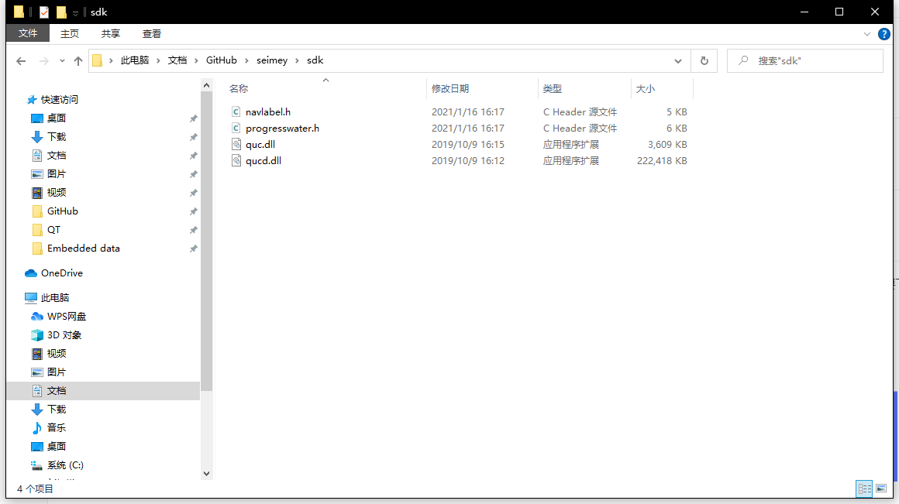
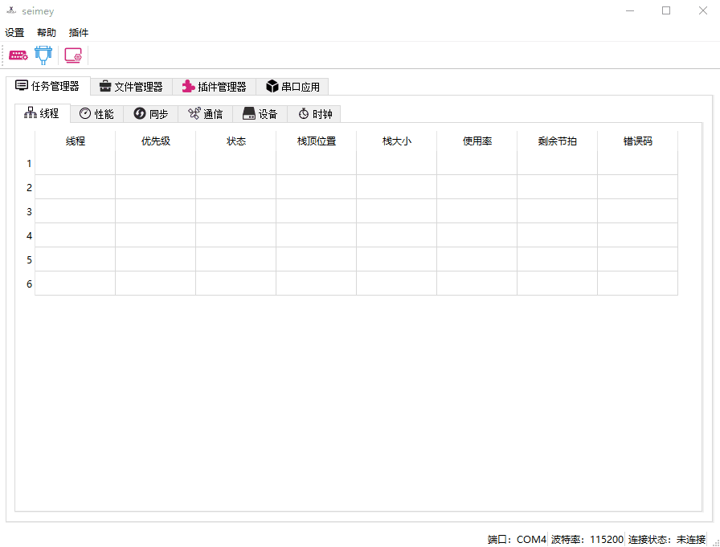
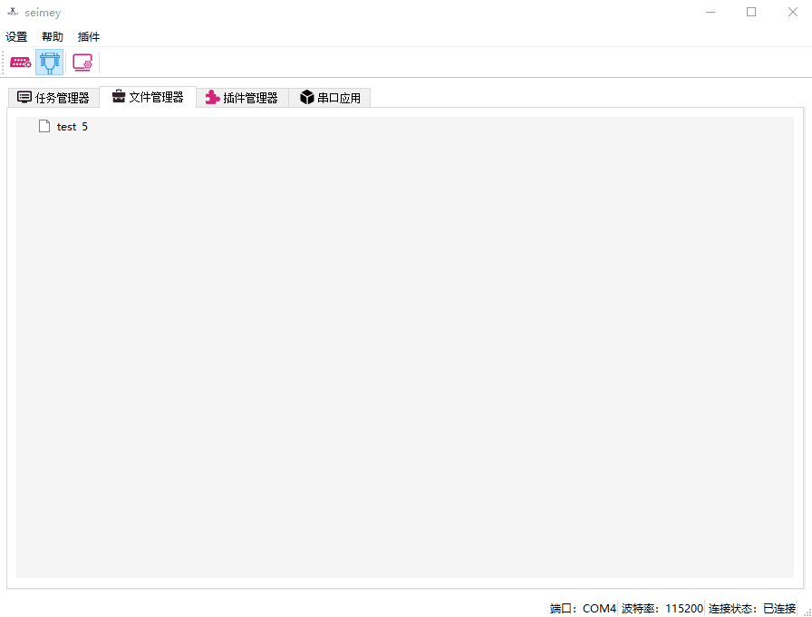
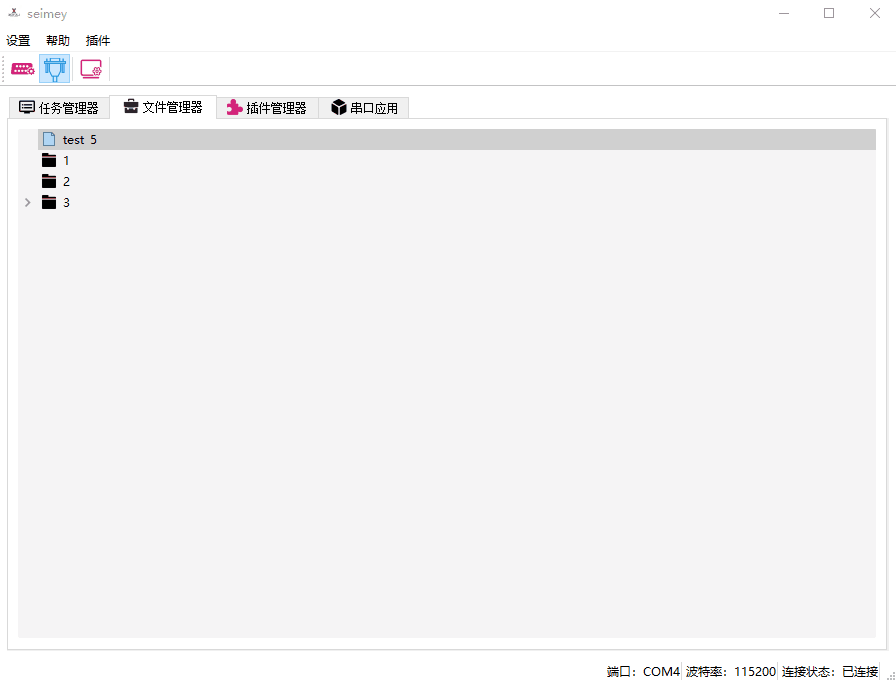
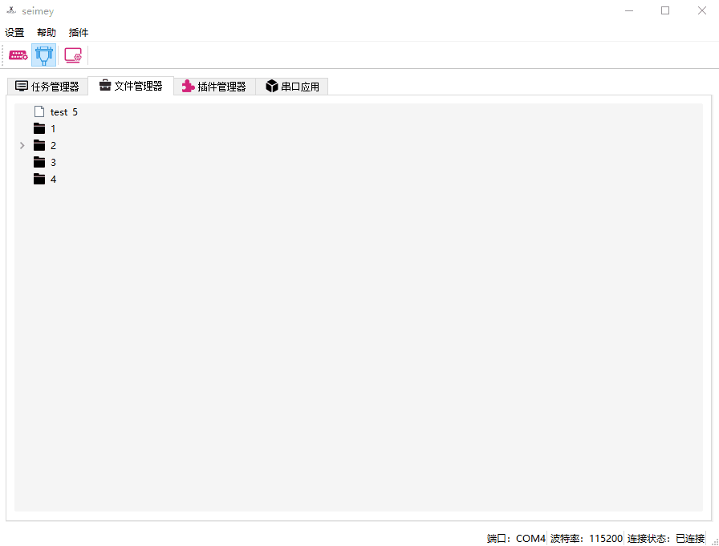
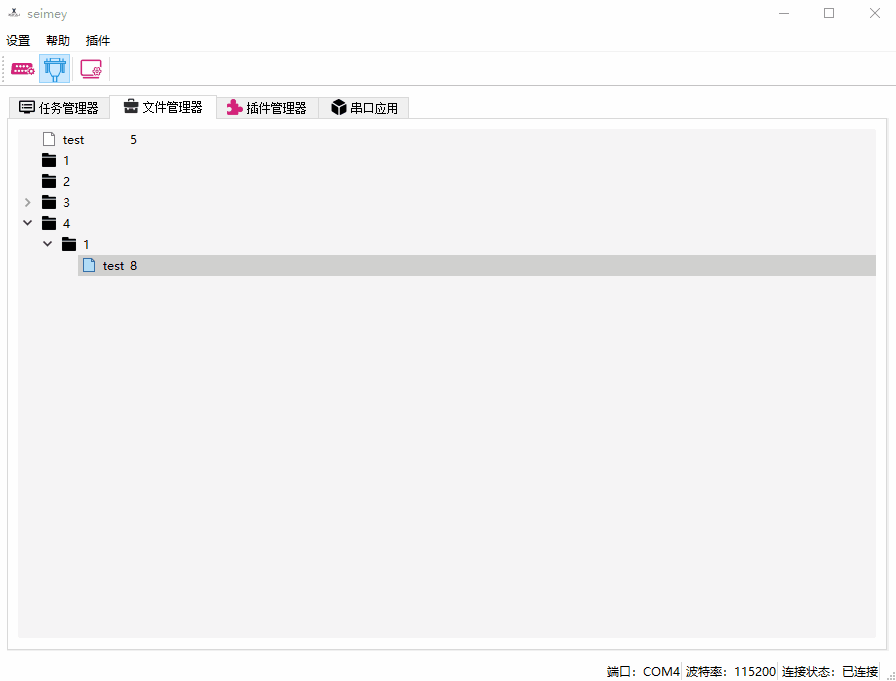

# seimey

此项目已作废，已搬迁到新项目[Misaka-Station](https://github.com/xqyjlj/Misaka-Station)

## 功能简介

​	一款串口终端，基于RT-Thread的FinSH控制台。

​	具有任务管理器，文件管理器，插件功能的终端。

## 设计初衷

​	在使用`Windows`的任务管理器时，有感而发，以及想对一些不适应shell的使用者提供一些便利。

## 更新说明

​	见文件[release_notes.md](https://github.com/xqyjlj/seimey/blob/master/release_notes.md)

## 编译说明 

因为本程序用到了其他的SDK（作者：**飞扬青云**）。且文件较大（大于100M）,因此本项目不提供此SDK，如果需要下载编译的，请移步到：

[github](https://github.com/feiyangqingyun/qucsdk/tree/master/sdk_V20191009)

[gitee](https://gitee.com/feiyangqingyun/QUCSDK/tree/master/sdk_V20191009)

选择对应版本之后，下载解压到sdk目录下，即可正常编译。



## 设置

> 通过设置来配置功能。



- 串口设置：用来选择串口的基本信息，具有记忆功能，可记下用户上次使用的设置。

- 设置：一些功能配置：

  - ​	是否保存串口数据：选择之后，程序会将收到的数据按照（“`\n`”还有“`\r\n`”进行分行，并且加上时间戳），存进文件夹（`\.workspace\.serial\serial.txt`）中。以下是列举的串口数据：

    ```c
    [ 2020-09-01 17:43:49:219 ] msh >list_timer
    [ 2020-09-01 17:43:49:223 ] timer     periodic   timeout       flag
    [ 2020-09-01 17:43:49:228 ] -------- ---------- ---------- -----------
    [ 2020-09-01 17:43:49:232 ] tshell   0x00000000 0x00000000 deactivated
    [ 2020-09-01 17:43:49:234 ] tidle0   0x00000000 0x00000000 deactivated
    [ 2020-09-01 17:43:49:240 ] timer    0x00000000 0x00000000 deactivated
    [ 2020-09-01 17:43:49:244 ] main     0x000003e8 0x055d17bd activated
    [ 2020-09-01 17:43:49:246 ] current tick:0x055d1785
    [ 2020-09-01 17:43:49:247 ] msh >
    ```

  - 定时刷新时间：由于任务管理器是依赖定时刷新来不断更新信息的，所以我们需要设置定时刷新的时间，但是为了不干扰单片机的本身程序，此值最小为0.5，单位为秒。

## 任务管理器功能


## 文件管理器功能

### 浏览



### 新建



### 删除



### 复制粘贴



## 插件功能

> 放入dll文件，即可在插件表里面找到该插件，[插件库地址](https://github.com/xqyjlj/seimey_plugin)

目前插件功能还在试验阶段，暂不开放。

